# ⚡ Pokémon

You can view the pretty version of the notes [here](https://jac-cs-game-programming-f23.github.io/Notes/#/6-Pokemon/).

## 🎯 Objectives

- **StateStacks**: We'll see how a StateStack, which supports running multiple states in parallel, is like a more advanced version of a State Machine.
- **GUIs**: Graphical User Interfaces, or GUIs for short, are what bring addition player interactivity into our games. GUIs can include panels, scrollbars, textboxes, and many more visual elements for navigating a game.
- **Turn-Based Systems**: We'll implement our battle mechanics using a turn-based system, which is a core feature of Pokémon and other RPGs.
- **RPG Mechanics**: Leveling up, experience, damage calculations - these are all a part of the RPG experience and we'll be taking a look at how to implement these features today.

Few franchises have achieved the degree of fame as Pokémon, short for "Pocket Monsters", a Japanese monster-catching phenomenon that took the world by storm in the late 90s. Even to this day, Pokémon is hugely successful, with games, movies, and various other forms of merchandise selling like crazy. The game formula itself is an addicting take on the JRPG, where the player can not only fight random Pokémon in the wild but also recruit them to be in their party at all times, where they can level up, learn new abilities, and even evolve.

This proof of concept demonstrates basic GUI usage, random encounters, and Pokémon that the player can fight and defeat with their own Pokémon.

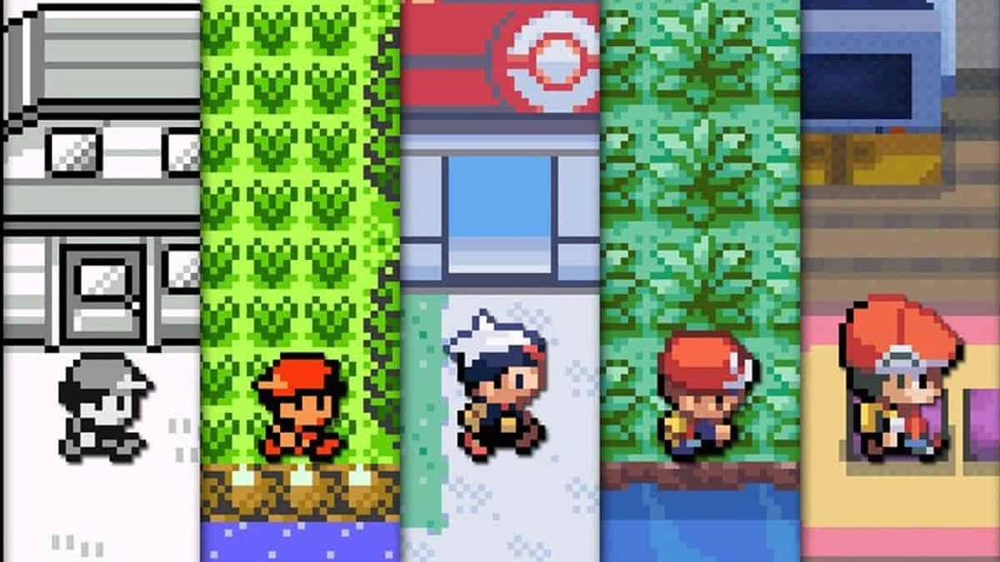

## 🔨 Setup

1. Clone the repo (or download the zip) for today's lecture, which you can find [here](https://github.com/JAC-CS-Game-Programming-F23/6-Pokemon).
2. Open the repo in Visual Studio Code.
3. Start Visual Studio Code's "Live Server" extension. If you don't have it installed:
   1. Click on the extensions icons in the left-hand side navigation.
   2. Search for "Live Server".
   3. Click install next to the extension by "Ritwick Dey". You may have to reload the window.

      

   4. Once it's installed, click "Go Live" on the bottom right of the window. This should start the server and automatically open a new tab in your browser at `http://127.0.0.1:5500/` (or whatever port it says on your machine).
      - The files the server serves will be relative to the directory you had open in VSC when you hit "Go Live".

## 🌅 Pokémon-0 (The "Day-0" Update)

In Pokémon-0, we create the tilemap from a map configuration file and implement tile-based movement for our player character.

### Map Files

A map file is simply a file (JSON in our case) that contains a list of numbers that will represent which sprite from the sprite sheet to render in the game. Here's a small example to get us started:

```json
[
    [0, 1, 2],
    [3, 4, 5],
    [6, 7, 8]
]
```

This is a 2D array representing a small map of 3x3 tiles where `[0][0]` is the top left and `[2][2]` is the bottom right. This makes it easy to move up/down/left/right around the map since all you have to do is +/- 1 from either the X or the Y relative to where you currently are. While this may be the "simpler" implementation, the author of [How to Make an RPG](https://howtomakeanrpg.com/) claims that it is actually more computationally/memory efficient to store this data as a 1D array:

```json
[0, 1, 2, 3, 4, 5, 6, 7, 8]
```

or

```json
[
    0, 1, 2,
    3, 4, 5,
    6, 7, 8
]
```

Here, `[0]` is the top left and `[8]` is the bottom right. How can we grab the desired tile based on an X and Y set of coordinates now? The formula is surprisingly simple: `tile = x + y * width`! In our example above, `width = 3`. If we wanted the top left tile, `(0, 0)`, we would calculate `0 + 0 * 3` which gives us the index `0`. Similarly, the bottom right tile, `(2, 2)`, can be retrieved by performing `2 + 2 * 3` giving us the index `8`. See? Easy!

### Important Code

- `./config/map.json`: A 15x11 map whose values correspond to the first few tiles in `./assets/tiles.js`. This file is read in `main.js` and the contents is passed to `Map`.
- `./services/Map.js`: The container for holding a 1D array of `Tile` objects that will represent the game world.
  - `getTile(x, y)`: Implements the formula in the previous section to retrieve one tile from the array based on a given `x` and `y`.
  - `generateTiles(layerData, sprites)`: Uses the array elements from `map.json` as the sprite IDs for the newly created `Tile` objects which comprise the map.
- `./services/Tile.js`: Represents one tile on the `Map` and on the screen.
- `./entities/Player.js`: The character being controlled by the player. What's unique to Pokémon is that the character's movement is locked to the grid unlike Zelda where the character could move anywhere on the map.
  - `./states/player/PlayerWalkingState.js`: We achieve this grid-locked movement by tweening the character's position when the player moves the character. This forces the character to smoothly transition from one tile to another over a set period of time. Only once the tween is over can the player move the character to another tile.

    ```javascript
    // PlayerWalkingState.js
    tweenMovement(x, y) {
        this.isMoving = true;

        timer.tween(
            this.player.canvasPosition,
            ['x', 'y'],
            [x * Tile.SIZE, y * Tile.SIZE],
            0.25,
            () => this.isMoving = false
        );
    }
    ```

    To illustrate this further, we've drawn a grid on the ground so that it is clearly evident that the player is always locked to the grid when moving. Try briefly tapping a direction key and notice that the character does not stop when you let go like the character in Zelda did!

  - `./states/player/PlayerIdlingState.js`: Simply renders the character standing still in whatever direction they're currently facing.

## 🗺️ Pokémon-1 (The "Map" Update)

In Pokémon-1, we generate a more sophisticated map with the help of the [Tiled map editor](https://www.mapeditor.org/). Using this program, we are able to generate maps that have multiple **layers** that can help us with things like collision detection and rendering order.

### Map Editor

Open the `./assets/images/tiles.png` sprite sheet and notice how large it is - `256x16064` pixels! Identifying the grass tile at index 2 is much easier to discern than the tree tile at index 431. Let's learn how we can simplify this process.

#### Setup

1. If you don't already have it installed, head over to [https://www.mapeditor.org/](https://www.mapeditor.org/) and download+install the Tiled map editor.
   - This is an excellent free and open source piece of software that we can leverage to make our lives easier when creating tilemaps.
2. Click `File > New > New Map` and enter the following configuration:

   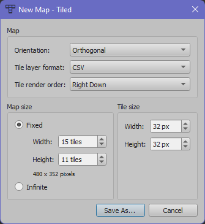

   - Change the name to whatever you'd like and save it to the `./Pokémon-1/assets/maps` folder.

3. You should now see a new blank map:

   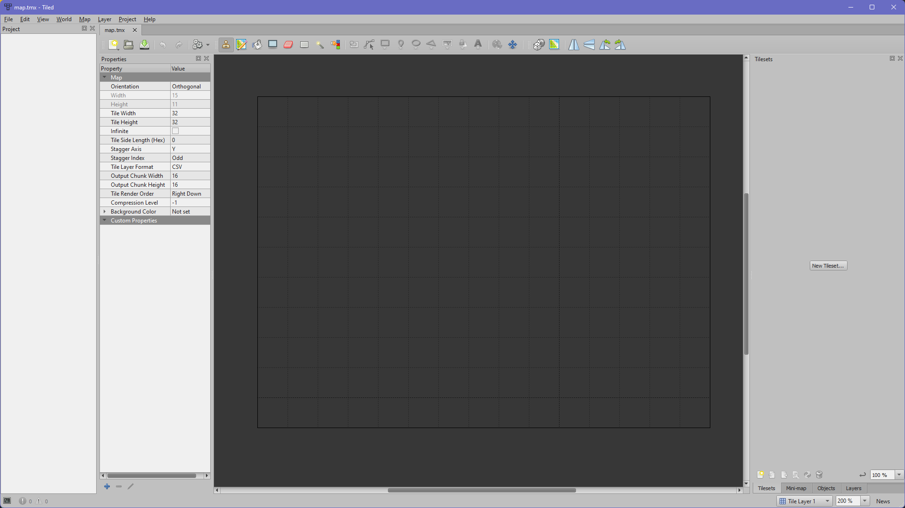

4. Click `File > New > New Tileset` and browse to the location of `./Pokémon-1/assets/images/tiles.png`:

   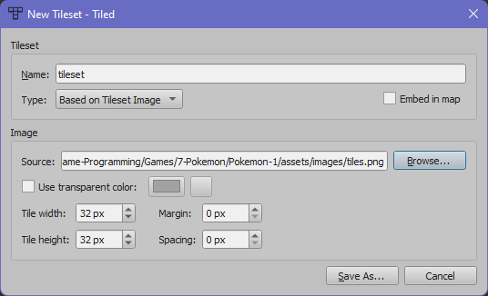

   - Change the name to whatever you'd like and save it to the `./Pokémon-1/assets/maps` folder.

5. You should now see the tileset broken up automatically into tiles:

   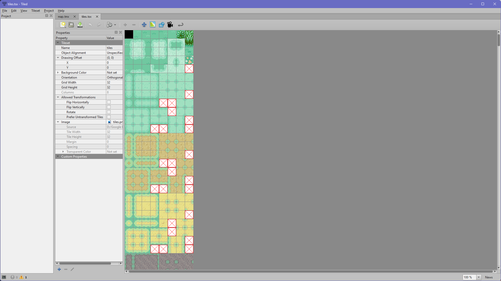

6. There should be two tabs at the top. The first one is the map editor, and the second one (screenshot above) is the tileset. Switch to the first tab so that we can start making our map!

#### Creating a Map

1. At the top you'll find several tools at your disposal. For our purposes, we'll be sticking with the rectangle tool:

   

2. Select the rectangle tool, then select a grass tile from the top row of the tileset on the right you want to paint. In the main map grid view, drag your mouse from the top left of the map to the bottom right, and you should get something like this:

   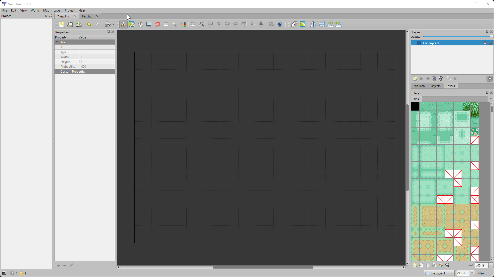

3. That looks too uniform! To vary it up, we could manually choose different grass tiles and paint them in various spots on the map, but there is an easier way.
   1. With the rectangle tool selected, select the dice icon 🎲 from the toolbar as well.
   2. Click and drag on the tileset to select multiple tiles:

      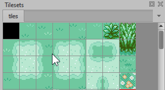

   3. Just as before, in the main map grid view, drag your mouse from the top left of the map to the bottom right, and you should get something less uniform:

      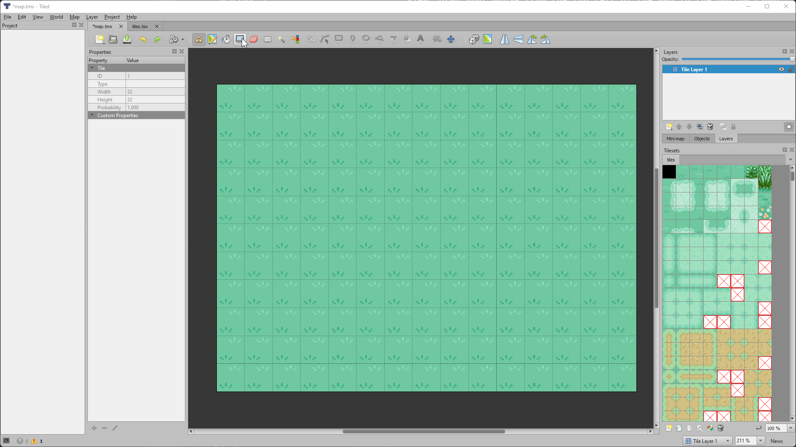

#### Adding Layers

For our Pokémon game, we'll want to have 3 distinct layers to our map. The first layer will be the base or background that the character will walk on. The second layer will be tiles that the player should not be able to walk on, i.e., collidable tiles. The third layer will be tiles that should always be rendered on top of the player to create a more accurate visual effect.

1. Rename the layer we just painted with grass by going to the _Layers_ panel on the top right and double clicking the name of the layer. Call it _Bottom Layer_:

   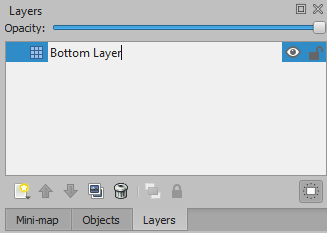

2. Click on the _New Layer_ icon and call the new layer _Collision Layer_:

   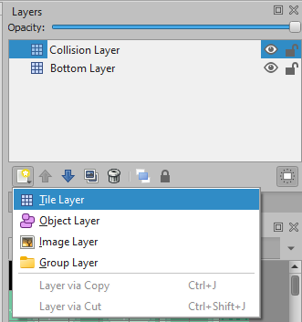

3. Make sure this new _Collision Layer_ is selected in the _Layers_ panel. You'll know it's selected because it will be highlighted in blue.

   > 💡 Something I like to do is lock all layers except the one I'm currently editing by clicking the lock icon 🔒 next to each layer. Too many times I found myself editing one layer when I thought I was editing another, and this saved me that headache!

4. Paint tiles on the _Collision Layer_ that you want the character not to be able to walk over. This could be a tree, buildings, or other objects.

   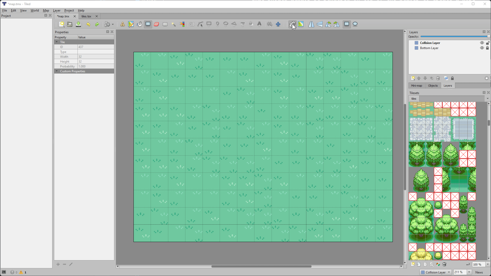

   > ⚠️ It's important that you only paint the tiles you want the character to bump into! Notice how I'm not painting the entire tree since I don't want the character to bump into the top of the tree, only the bottom.

5. Create a new layer just as before and call it _Top Layer_. On this new layer, paint tiles that you want to always be rendered in front of the character.

   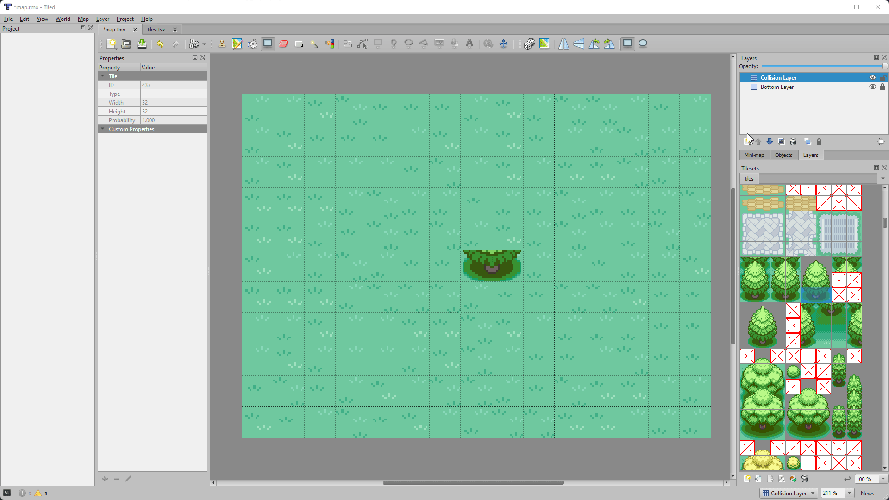

6. Finally, save the project file (`CTRL+S`/`CMD+S`) so that you can close the program and come back to it later.

#### Loading the Map

1. Click `File > Export As` and save it as `./Pokémon-1/config/map.json`. It's important that the file is called exactly this and saved in this exact location.
2. Start up Live Server, navigate to `Pokémon-1` and you should see your map loaded in and your character should interact with the world properly:

   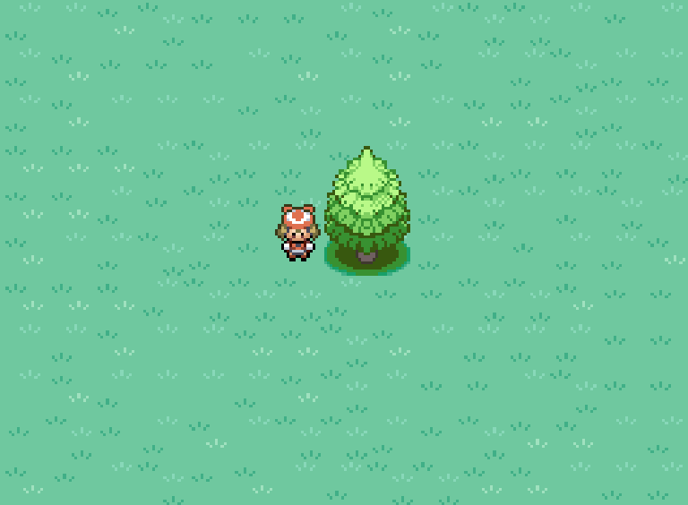

3. Awesome! Lastly, there is functionality built into only this specific update that allows us to toggle each layer. Hopefully, this will illustrate how/when each layer is being drawn, and how the character fits in between the layers:
   1. Press `1` to toggle the bottom layer.
   2. Press `2` to toggle the bottom layer.
   3. Press `3` to toggle the bottom layer.

Let's look at the code to see how we're implementing the collision detection!

### Important Code

- `./services/Layer.js`: We moved most of what was in `Map.js` previously into this file. Each `Layer` object will now contain tile information about that specific layer which `Map` will draw.
  - `Layer::generateTiles(layerData, sprites)`: Takes the exported data from Tiled which lives in `./config/map.json` and uses it to create new `Tile` objects. One thing to note is that Tiled exports data indexed from `1` and not `0`, so we have to adjust this in this function. If we get a tile with ID of `-1`, then we don't instantiate a new `Tile` object for that location, we just assign that space to `null`.
- `./states/player/PlayerWalkingState.js`: Since we give a reference to the `Map` when creating a `Player`, this means we can use the `Layer::getTile(x, y)` function from within `PlayerWalkingState`.
  - `PlayerWalkingState::isValidMove()`: Returns `true` if the player is going to move on to a non-collidable (i.e., not `null`) tile.

    ```javascript
    isValidMove(x, y) {
        return this.collisionLayer.getTile(x, y) === null;
    }
    ```

- `./services/Map.js`: We take care to render first the bottom layer, then the collision layer, then the player, then the top layer. In addition to this, in `Player::render()`, we offset the Y to be a bit higher than default. This offset combined with the Map's rendering order ensures that the game looks the most visually accurate!

## 💬 Pokémon-2 (The "Textbox" Update)

In Pokémon-2, we add a user interface (UI) system to the game using a _State Stack_. In RPG games in general, there are usually many menus and textboxes to navigate to access things like the settings, inventory, and actions during a battle. These various UI elements must be drawn on top of whatever state we're currently in, and when the player dismisses the element, they should be able to resume exactly where the left off.

### Stack

A stack is an ordered list of elements where an element is inserted at the end of the stack and is removed from the front of the stack.

Unlike a queue, which works based on the first-in, first-out (FIFO) principle, a stack works based on the last-in, first-out (LIFO) principle.

A stack has two main operations involving inserting a new element and removing an existing element. The `push()` operation inserts an element at the top of the stack, and the `pop()` operation removes an element from the top of the stack.


_Image from [JavaScriptTutorial](https://www.javascripttutorial.net/javascript-stack/)_

### State Stack

- The StateStack is the foundational class for this project; every other part of this program revolves around it.
- Previously, this had been the role of the State Machine. However, while a State Machine allows us to work with one state at a time, **a StateStack will allow us to render multiple states at once**.
  - For example, if you envision our states as a stack, you can imagine having the `PlayState` in the bottom of the stack as our player walks around, when suddenly a `DialogueState` is pushed onto the stack.
  - Rather than having to transition from `PlayState` to `DialogueState` (as we would've had to with a State Machine), we can simply "pause" the `PlayState` and render the `DialogueState` on top of it.
  - This allows us to return back to previous states as they were when we left them, rather than create new ones.
  - Only the top-most state on the stack is being updated, though this could be changed if we wanted it to.

In this example, a `DialogueState` which contains a `Textbox` is pushed onto the stack by hitting the enter key. As more and more states are added to the stack, we can see the stack visually grow on the left. When the escape key is hit, the textbox is dismissed and the state is popped off the stack.

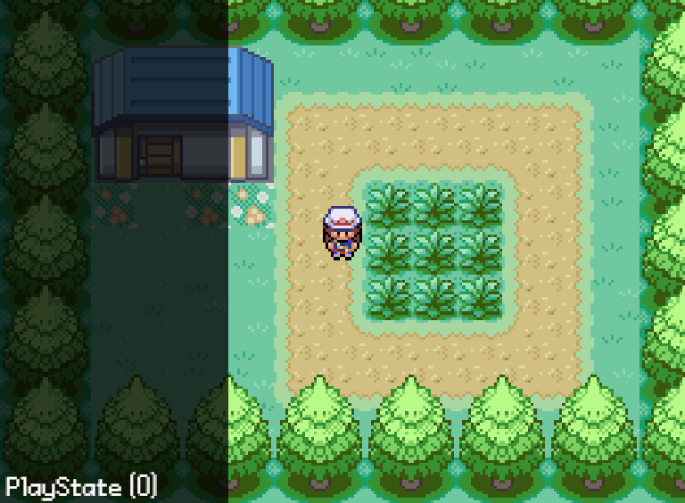

Notice how every state is still being rendered, but only the topmost state is the one listening for updates. This is why when the escape key is hit, only the top textbox disappears and not all of them at once. Try this out and try to move the character when there is a textbox on the screen!

### Class Diagram

The states will have their own UI elements as needed. Taking the example from the previous section, `DialogueState` would have an instance of a `Textbox` UI element. Here are the UI elements we'll be using for our Pokémon game:

```plantuml
@startuml Pokémon User Interface

skinparam monochrome true
hide empty members

class UserInterfaceElement {
    position
    dimensions
}

class Menu {
    selection
}

class Panel {
    isVisible
    toggle()
}

class Selection {
    items
    currentSelection
    navigateUp()
    navigateDown()
    select()
}

class Textbox {
    fontSize
    isAdvanceable
    isClosed
    pages
    createPages()
    next()
    nextPage()
    getLines()
}

UserInterfaceElement <|-- Panel
UserInterfaceElement <|-- Selection
Panel <|-- Menu
Panel <|-- Textbox

Selection "1 " --* Menu

@enduml
```

### Important Code

- `./lib/StateStack.js`:
  - `constructor()`: Initializes a states array which will represent the stack.
  - `update()`: Calls `update()` on the topmost state in the stack.
  - `render()`: Calls `render()` on all states in the stack.
  - `push()`: Adds a new state to the stack and calls the newly-added state's `enter()` method.
  - `pop()`: Removes and returns the topmost state from the stack and calls its `exit()` method.
  - `top()`: Returns the topmost state from the stack.
  - `clear()`: Sets the stack array to empty.

  > 💡 While we don't implement it in this game, it could be possible for each state to implement a `updateAI()` method for NPC logic. This method would then be called for the topmost state by the `StateStack`.

Before we add new states to the stack, we should create some UI elements first.

- `./user-interface/UserInterfaceElement.js`: The base class all UI elements will inherit from since `position` and `dimensions` are a common attribute among all UI elements.
- `./user-interface/elements/Panel.js`: Two rectangles on top of each other with slightly different sizes and colors.
- `./user-interface/elements/Selection.js`: A list of `items` which are objects that each have a string `text` and function `onSelect` property. The player can navigate this list with the arrow keys and select an option with enter or spacebar.
- `./user-interface/elements/Menu.js`: A `Panel` with a `Selection` laid overtop.
- `./user-interface/elements/Textbox.js`: A `Panel` with text laid overtop. The complicated part is taking the string of text you want to display and separating it out into "pages" that fit within the panel's dimensions.
  - `Textbox::getLines(text, maxWidth)`: Splits up the given `text` into lines based on the `maxWidth` of the panel.
  - `Textbox::createPages()`: Takes the lines from `getLines()` and groups them into pages based on the height of the panel.
  - `Textbox::next()`: When the player hits enter or spacebar, advance to the next page of text.
- `./states/game/DialogueState.js`: Displays a `Textbox` which the player can view and advance themselves.

## 🐲 Pokémon-3 (The "Monster" Update)

In Pokémon-3, we implement, you guessed it, Pokémon! A Pokémon is really just a box full of various numbers that represent different aspects of the Pokémon. We'll be sticking to the basics for our game by implementing _health_, _attack_, _defense_, and _speed_.

### Stats

This is by no means necessary, but if you're curious as to how a Pokémon's stats get calculated, [you can read up about it here](https://bulbapedia.bulbagarden.net/wiki/Individual_values).

#### TL;DR

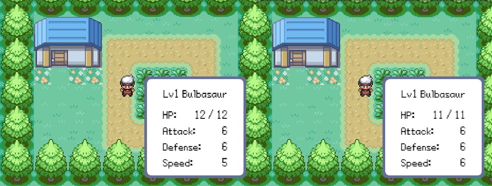

- Pokémon are created with random _Individual Values_ (IVs) which are like the Pokémon's "genetic material". This is how two Pokémon of the same level and species might have differing stats - perhaps one has higher health, while the other has higher speed.
- Every Pokémon also has a set of _base stats_ that they start off with at level 1. These base stats are the same for every single instance of the same Pokémon. Meaning, any 2 Bulbasaur will always have the same base stats.
- Using the specific Pokémon's IVs in conjunction with their base stats, the actual stats of the Pokémon are calculated using mathematical formulae. These formulae differ from game to game, but the core concept remains the same.

### Important Code

- `./config/pokemon.json`: A collection of names and stats, which makes it trivial for a non-programmer to create additional Pokémon and help out in the overall design of the game.
- `./src/services/PokemonFactory.js`: The configuration data is loaded into the factory such that we can use the `createInstance()` method to spit out any Pokémon we want.
- `./src/enums/PokemonName.js`: To reference the Pokémon by something sturdier than just a string. You'll see that it's empty; we're actually dynamically creating these enums inside `PokemonFactory::load()`.
- `./src/entities/Pokemon.js`: The box of numbers that constitutes a Pokémon. Honestly, look inside, they really are just a bunch of numbers! Later they'll have couple of sprites associated with them but that's about it. It's remarkable they've been able to create one of the most successful game franchises around this!
- `./src/user-interface/PokemonStatsPanel.js`: Extends the `Panel` UI element to display the stats of the Pokémon.
- `./src/states/game/PokemonStatsState.js`: Instantiates a `PokemonStatsPanel` to display to the player.
- `./src/entities/Player::initializeParty()`: Uses the `PokemonFactory` to populate the player's party with one Pokémon.

## 🥊 Pokémon-4 (The "Battle" Update)

In Pokémon-4, we set up everything needed for our cute and cuddly boxes of numbers to battle. The Pokémon won't be able to inflict damage to each other; that will be in the next update. There's already lots we need to add to this update without the Pokémon actually fighting yet!

### Callback Functions

By this point, you should be comfortable with the callback function pattern. **We're going to be using a LOT of callbacks from here on out**, so if you need a refresher, there are [many](https://youtu.be/xHneyv38Jro) [videos](https://youtu.be/cNjIUSDnb9k) you can watch!

In brief, a callback function is a way to **enforce an order of operations** when dealing with **asynchronous code**.


_Image from [4PSA](https://blog.4psa.com/the-callback-syndrome-in-node-js/)_

> 💡 Normally, we would want to avoid chaining so many callbacks by using [JavaScript Promises](https://developer.mozilla.org/en-US/docs/Web/JavaScript/Reference/Global_Objects/Promise) with [`async`/`await`](https://developer.mozilla.org/en-US/docs/Learn/JavaScript/Asynchronous/Async_await). For now, we will stick with callbacks since they're a bit easier to implement up front. However, refactoring this code to use promises is most definitely an excellent idea!

Many of our states will be written in this way so that we can support asynchronous behavior. For example, if we want something to happen after a dialogue screen is closed, but we don't know when the user will close it, we can just include the desired functionality in a callback function which will be executed once the user finally closes the dialogue screen.

### Important Code

- `./src/states/game/BattleState.js`:
  - As expected, sets up our battle. We set up the player, the dialog screen, the opponent, the health indicators, setting flags along the way to ensure nothing is rendered out of turn.
  - Mainly depends on `triggerBattleStart()` to kick off the battle, tweening in the components of the battle screen and subsequently triggering the dialogue via `triggerStartingDialogue()`, which displays the dialogue and eventually pushes the `BattleMenuState` to the `StateStack`.
- `./src/states/game/BattleMenuState.js`:
  - This is where we present the `Selection` menu to the player and define what happens when the player chooses _FIGHT_ or _STATUS_.
  - Most of the logic in this file is in the constructor, in which we create the menu and define the callback functions for each selection.
  - When the player selects _FIGHT_ or _STATUS_, we push a `BattleMessageState` to the `StateStack`. Once that state is popped automatically after 2 seconds, we come back to this menu state to rinse and repeat. The actual fighting logic will be implemented in the next update.
- `./src/states/game/BattleMessageState.js`: Displays an in-combat message to the player to describe the last action that occurred. These states can either be popped automatically after a given period of time or dismissed by the player by hitting enter.
- `./src/states/game/BattlePanel.js`: Two instances of these objects represent the panels in the battle screen that display each Pokémon's name, level, and health.
- `config/assets.json`: We've added the Pokémon sprites to be displayed in battle. `Pokemon.js` has also been updated to hold instances of these sprites.
- `./src/states/player/PlayerWalkingState.js`:
  - `PlayerWalkingState::ENCOUNTER_CHANCE`: Used to determine if we go into battle or not when walking over grass tiles.
  - `PlayerWalkingState::checkForEncounter(x, y)`: Checks if we're currently walking on a grass tile, and if so, randomly starts a battle 10% of the time.
  - `PlayerWalkingState::startEncounter(x, y)`: Pushes a new instance of `BattleState` onto the stack. We pass the player instance to the new `BattleState` as well as a new instance of `Opponent` which is just a stripped down version of the `Player` class.


## 🃏 Pokémon-5 (The "Turn" Update)

In Pokémon-5, we force our cute cuddly boxes of numbers to damage each other until one of them ~~dies~~ faints. When you put it that way, it's strange that this game is marketed towards children!

### Important Code

There's only one new file for this update: `./src/states/game/BattleTurnState.js`, and it is instantiated by `BattleMenuState` when the player chooses _FIGHT_!

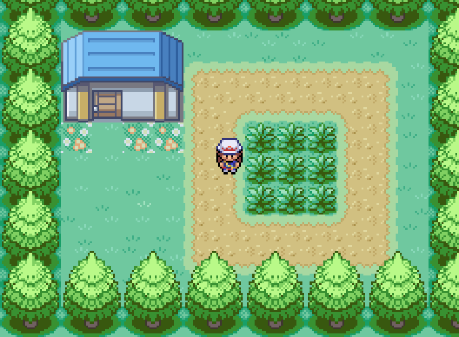

- `BattleTurnState::constructor()`:
  - Stores the current `battleState` and determines which Pokémon should attack first based on speed. If the speed of both Pokémon are the same, then it falls back to a coin flip.
- `BattleTurnState::enter()`:
  - Calls the attack function for each Pokémon and checks for battle-end conditions after each attack.
- `BattleTurnState::attack()`:
  - First pushes a `BattleMessageState` to let the player know who is attacking, then plays the attack animation.
- `BattleTurnState::inflictDamage()`:
  - After the animation is complete, the damaged Pokémon is made to blink a few times, and their health is decreased upon damage calculation.
- `BattleTurnState::checkBattleEnded()`:
  - Checks whether a Pokémon's health has been depleated, and if so, causes them to faint.
- `BattleTurnState::processDefeat()`:
  - Drops the player's sprite from the screen, and pushes a `BattleMessageState` to let the player know they've fainted. Then, it pops twice to go back to the `PlayState`.
- `BattleTurnState::processVictory()`:
  - Drops the enemy sprite from the screen and pushes a `BattleMessageState` to let the player know they've won. Then, it pops twice to back to the `PlayState`.
- `PlayState::healParty()`:
  - If the player lost the last battle, their Pokémon will be healed to full health. A `DialogueState` will be pushed to let the player know their Pokémon has been healed.

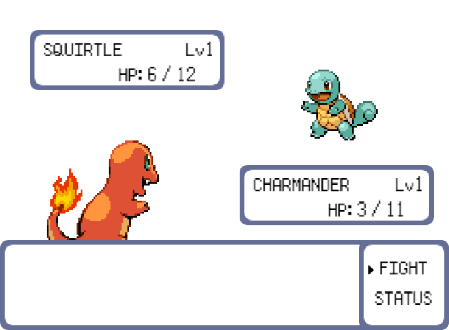

## ⬆️ Pokémon-6 (The "Level" Update)

In Pokémon-6, we implement a level up system whereby Pokémon can earn experience points when they win battles. If enough experience points are earned, the Pokémon will level up which means all their stats get a boost to make them stronger.

### Experience

In the core series games, experience is normally gained by all Pokémon who have been sent out against an opponent's Pokémon, divided evenly among them. Experience is gained upon the opponent Pokémon fainting, and its amount is calculated as a function of the fainted Pokémon's level, as well as species. Certain items can affect the distribution and amount of experience gained, as can other conditions, such as whether or not the Pokémon was caught by another person or in another language of the game.

Our implementation will be a simplified version of the above since we don't have items or various other conditions. All Pokémon in our game will use the [_medium fast_ leveling formula](https://bulbapedia.bulbagarden.net/wiki/Experience#Experience_at_each_level) to calculate how much experience is needs to level up.

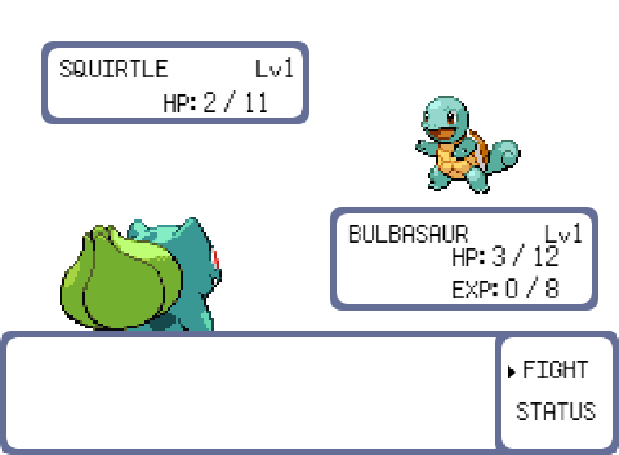

### Important Code

There are a few new additions to the `Pokemon` class to implement an experience system.

- `Pokemon::experienceFromLevel(level)`: Uses the [_medium fast_ leveling formula](https://bulbapedia.bulbagarden.net/wiki/Experience#Experience_at_each_level) to determine how much experience is required to reach the provided `level`.
- `Pokemon::constructor()`: Three new fields have been added for experience:
  - `levelExperience`: How much experience it took to get to the Pokémon's current level. This is used to calculate the experience delta that the experience gauge displays during battle.
    - Example: It takes `experienceFromLevel(3) === 27` experience to get a Pokémon to level 3.
  - `currentExperience`: How much experience the Pokémon currently has.
    - Example: A level 3 Pokémon has at least `experienceFromLevel(3) === 27` experience. If they then defeat a Pokémon in battle and gain 10 experience, they will have a total of 37 current experience.
  - `targetExperience`: How much experience the Pokémon needs to level up.
    - Example: A level 3 Pokémon needs `experienceFromLevel(3 + 1) === 64` experience to level up.
- `Pokemon::levelUp()`: Increments the Pokémon's level, calculates new `levelExperience` and `targetExperience` values, and increases the stats of the Pokémon.
- `Pokemon::calculateExperienceToAward(opponent)`: Once an opponent Pokémon is defeated, this function calculates the amount of experience the player Pokémon will receive based on [this simplified gain formula](https://bulbapedia.bulbagarden.net/wiki/Experience#Gain_formula).
- `Pokemon::getExperienceMeter()`: This is where we use `targetExperience`, `levelExperience`, and `currentExperience` to display the proper delta to the player so that they know now much experience their Pokémon needs to level up.

`BattleTurnState` now has two additional functions to handle experience points after a victory in battle.

- `BattleTurnState::processExperience()`:
  - Determines the amount of experience to award to the winning Pokémon and displays that information to the player in a new `BattleMessageState`.
- `BattleTurnState::processLevelUp(experience)`:
  - After the message is displayed, we check if it was enough experience to level up. If so, we call `Pokemon::levelUp()` which will handle calculating all the boosted stats for us.
  - Lastly, we display a `BattleMessageState` to the player to let them know their Pokémon leveled up.

Finally, `BattlePanel` is now split into `Battle/PlayerPanel` and `Battle/OpponentPanel` since now we have to display different information in the `BattleState` depending on the player's Pokémon and the opponent's Pokémon.

## ✨ Pokémon-7 (The "Polish" Update)

In Pokémon-7, we add sounds, additional sprites, a `TitleScreenState`, and a `TransitionState` that helps us smoothly fade from one state to the next.

### Important Code

- Everyone should be comfortable with how to add sounds and music to our games since we've done it from day 1! Check out `./assets/sounds`, `./config/assets.json`, and `./src/enums/SoundName.js` for the definitions.
- The battle screen now has a background and platforms which can be found in `./assets/images`.
- `./src/user-interface/PokemonStatsPanel.js`: Now has an icon animation whose speed is determined by the Pokémon's current health to convey "liveliness".
- `./src/states/TransitionState.js`: Uses tweens to fade in/out a white rectangle on the screen. We can pass in a callback that contains an instantiation for a new state if we want to fade into a new state. By default, the callback is a pop, meaning the fade will result in the previous state we were in.
  - We call this state when entering a battle in `PlayerWalkingState::startEncounter()`.
  - We call this state when exiting a battle in `BattleTurnState::exitBattle()`.
- `./src/states/TitleScreenState.js`:
  - Consists of some text fields and a carousel of sprites that are displayed on the screen. There is then a fading transition to the next screen.
  - Monitors whether the user has pressed the "enter" key, and if so, calls `TransitionState.fade()` which will pop the current `TitleScreenState` and push the `PlayState` halfway into the fade.
  - On entering `PlayState`, a new `DialogueState` is pushed, so that rather than jumping head first into the game, the user can read some instructions.

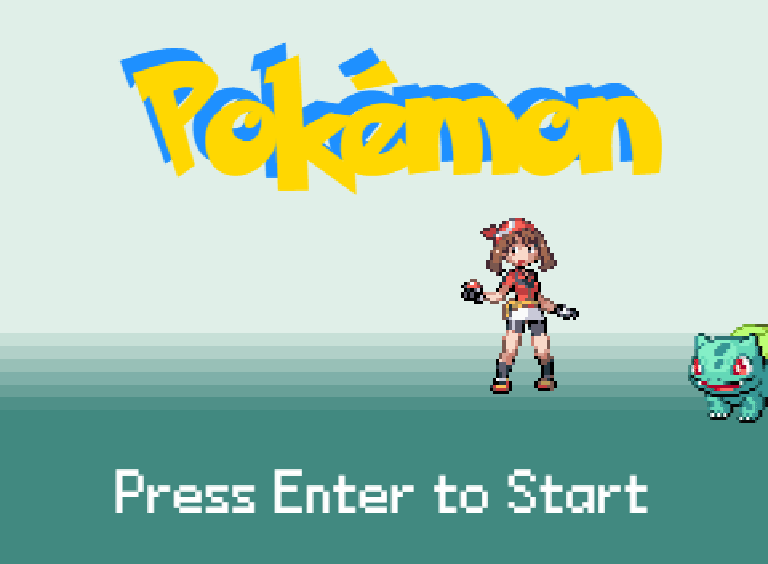

And with that, we have a fully functioning game of Pokémon!

## 📚 References

- [Harvard's CS50 Introduction to Game Development - Pokémon](https://cs50.harvard.edu/games/2018/notes/7/)
- [How to Make an RPG](https://howtomakeanrpg.com/)
- [Pokémon using RPG Maker](https://www.youtube.com/playlist?list=PLuIp7Uf7pllmpcFOHbj4r8cVQYywpRZB5)
- [Pokémon using Unity](https://www.youtube.com/playlist?list=PLLf84Zj7U26kfPQ00JVI2nIoozuPkykDX)
